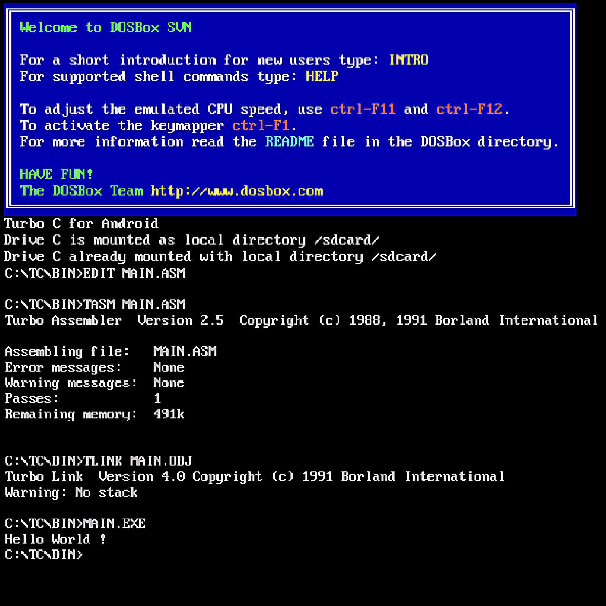

# Assembly

> Program :

```asm
DATA SEGMENT

     MSG DB "Hello World !$"
     
DATA ENDS

CODE SEGMENT  
    ASSUME DS:DATA, CS:CODE
    
    START:
        MOV AX,DATA
        MOV DS,AX
        
            LEA DX,MSG
            MOV AH,9
            INT 21H
        
        MOV AH,4CH
        INT 21H
        
CODE ENDS

    END START
```

* How To Run :   
   * Open Terminal in this Folder
   * Using `edit` command for creating/editing `.asm` like below
      > `C : \ Download \ ReadyForAssembly > edit Main.asm`
   * Save Edited file and Exit to terminal
   * Using `masm` command for making the assembly to `.obj` like below
      > `C : \ Download \ ReadyForAssembly > masm Main.asm`
   * Using `link` command for linking the objects to `.exe` like below
      > `C : \ Download \ ReadyForAssembly > link Main.obj`
   * Using File name with extension `.exe' for Running the Executable like below
      > `C : \ Download \ ReadyDorAssembly > Main.exe`

> OutPut :



## Download : [DOS Box](DOS%20Box_1.1.1.apk?raw=true)
## Download Required Files : [TC zip](TC.zip?raw=true)
